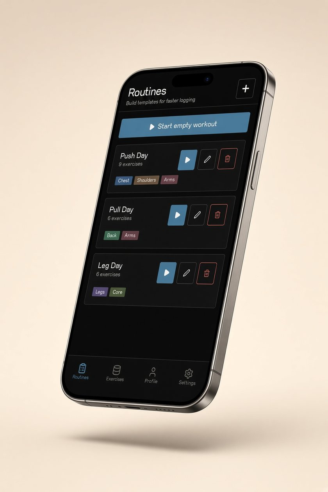
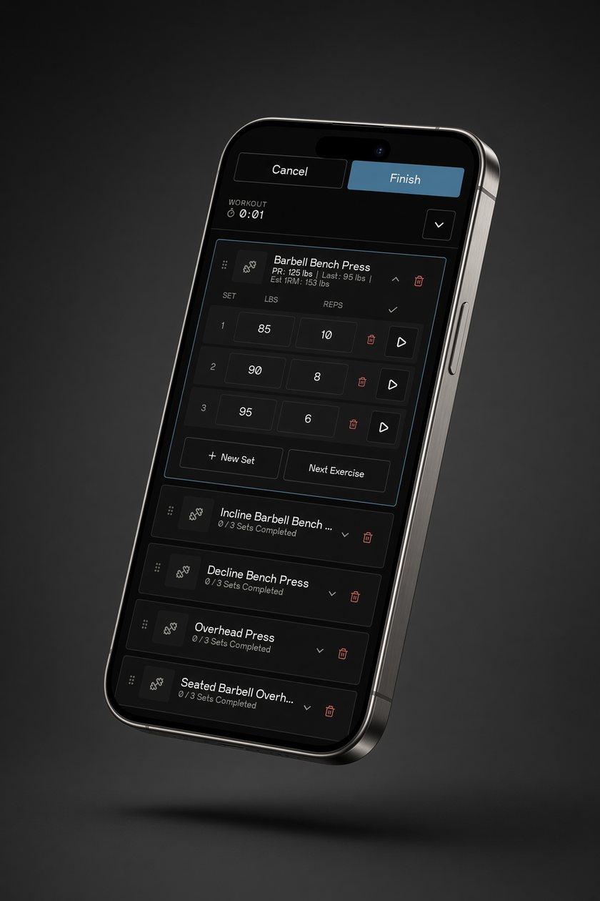
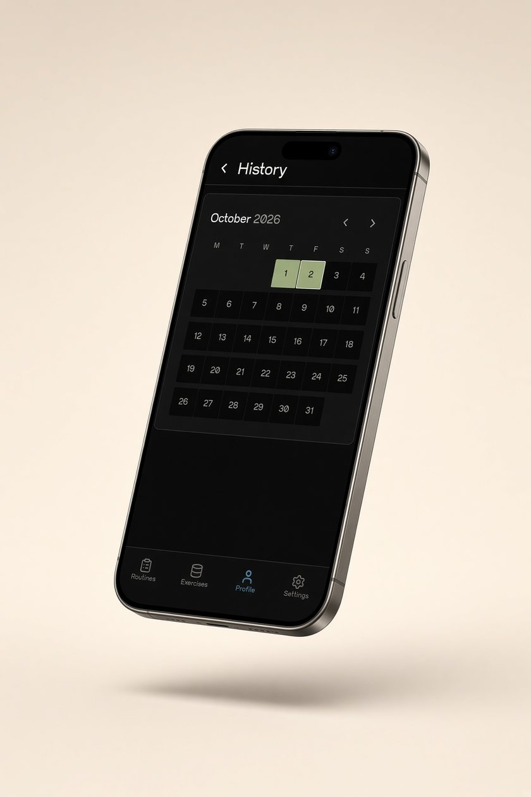
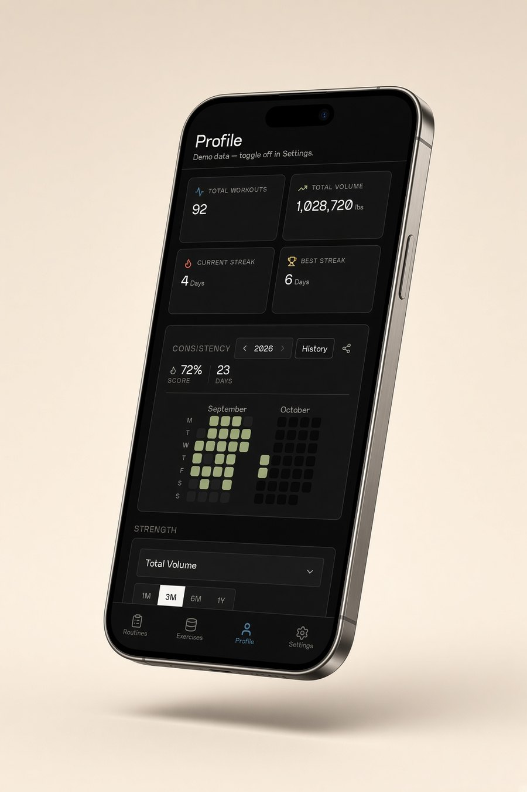
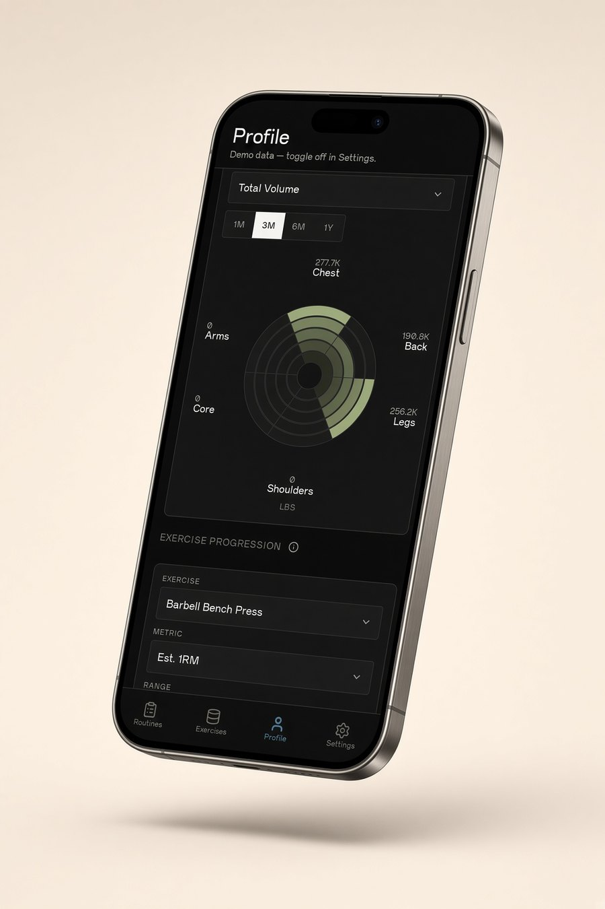
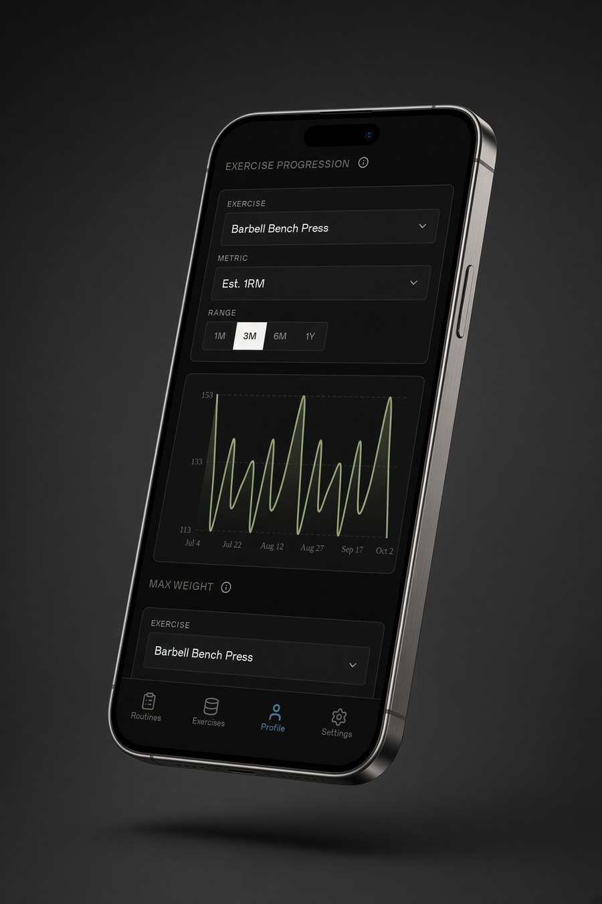

# TrackHit

A private, local-first workout logger. Routines, sets, rest, history, and progress stay on the phone. No account. No cloud. No ads.

<p>
  <a href="https://apps.apple.com/ca/app/trackhit/id6813176338"></a>
  &nbsp;&nbsp;
  <a href="https://emayan08.github.io/workout-tracker/"></a>
</p>

[App Store](https://apps.apple.com/ca/app/trackhit/id6813176338) · [Website](https://emayan08.github.io/workout-tracker/)

## Screens

Product shots from the demo log.

<table>
<tr>
<td width="50%" align="center">
<br>
<strong>Routines</strong><br>
Push, Pull, and Legs. Start a session in one tap.
</td>
<td width="50%" align="center">
<br>
<strong>The session</strong><br>
Weight, reps, and a rest timer that stays on the phone.
</td>
</tr>
<tr>
<td width="50%" align="center">
<br>
<strong>History</strong><br>
A calendar of the days you actually lifted.
</td>
<td width="50%" align="center">
<br>
<strong>The map</strong><br>
Streaks, volume, and the consistency heatmap.
</td>
</tr>
<tr>
<td width="50%" align="center">
<br>
<strong>Strength</strong><br>
Volume by muscle, from a month to a year.
</td>
<td width="50%" align="center">
<br>
<strong>The line</strong><br>
Estimated one-rep max for one lift, over time.
</td>
</tr>
</table>

| | |
|---|---|
| Version | 1.0.0 |
| Bundle ID | `com.trackhit.app` |
| Platform | iPhone (iPad is off) |
| Source of truth | **`main`** |

`react-native-app` was merged into `main` (PR #1). New work lands on `main`.

---

## What lives where

| Path | What it is | Ships? |
|---|---|---|
| [`frontend/`](frontend/) | Expo SDK 57 app (React Native). This is the product. | Yes — EAS production build |
| [`docs/`](docs/) | Marketing site, privacy policy, support, feedback. GitHub Pages. | Yes — auto-deploy from `main` |
| [`store-assets/`](store-assets/) | Imagine mockups used while designing the listing. | No — not the store screenshots |
| [`backend/`](backend/) | Old REST API from before TrackHit went local-only. | **No.** The 1.0 app does not call it. |
| [`frontend/app-store-checklist.md`](frontend/app-store-checklist.md) | Submission checklist | Docs |
| [`frontend/APP-REVIEW-2.1.md`](frontend/APP-REVIEW-2.1.md) | First-review reply (Guideline 2.1) | Docs |

The empty root `API_README.md` is leftover. The live API notes, if you ever need them, are in `backend/API_README.md`. Do not turn that server back on for the App Store app without a new privacy policy.

---

## Run the app

```bash
cd frontend
npm install
npx expo start
```

Tests:

```bash
cd frontend
npm run test:unit
```

Store builds (from `frontend/`):

```bash
eas build --platform ios --profile production
eas submit --platform ios --profile production
```

`eas.json` production profile does **not** auto-increment the build number. Bump `ios.buildNumber` in [`frontend/app.json`](frontend/app.json) yourself before the next binary.

Expo Go is for development only. The App Store binary is the EAS production build.

---

## Deploy the website from `main`

Pushing `docs/**` (or the Pages workflow) to **`main`** deploys [GitHub Pages](https://emayan08.github.io/workout-tracker/) via [`.github/workflows/deploy.yml`](.github/workflows/deploy.yml).

| Page | URL |
|---|---|
| Site | https://emayan08.github.io/workout-tracker/ |
| Privacy (App Store privacy URL) | https://emayan08.github.io/workout-tracker/privacy/ |
| Support (App Store support URL) | https://emayan08.github.io/workout-tracker/support/ |
| Feedback | https://emayan08.github.io/workout-tracker/feedback/ |

A push that only changes `frontend/` does **not** publish a new iOS binary and does **not** redeploy Pages. The phone app updates only when you run EAS and submit.

---

## What the app does

- Build routines and start a session, including a rest day with zero exercises
- Log sets with a custom keypad, rest timer, and local notifications
- History calendar and Profile charts (consistency, strength, duration)
- JSON backup export and import
- Light / dark theme and a chart color you pick in Settings
- Settings shows the TrackHit icon and the current version

Data is AsyncStorage on the device. There is no sign-in, no analytics SDK, and no In-App Purchase.

---

## Author

Emayan Vadivel — [LinkedIn](https://www.linkedin.com/in/emayan-vadivel/) · [emayanramalingam@gmail.com](mailto:emayanramalingam@gmail.com)
